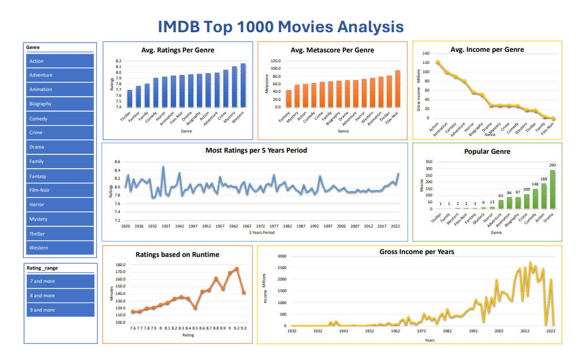

# 🎬 IMDb Top 1000 Movies Analysis

This project analyzes the top 1000 IMDb movies using Microsoft Excel. It focuses on key metrics such as ratings, genres, and release years to uncover trends and insights in the film industry.

## 📁 Files Included

- `IMdB_Top1000.csv`: Dataset containing details of the top 1000 IMDb movies.
- `IMdB_Top1000_Workbook.xlsx`: Excel workbook with data analysis and visualizations.
- `IMDB_Dashboard_image.png`: Image preview of the Excel dashboard.
- `imdb_dashboard.pdf`: PDF version of the dashboard.

## 🎯 Project Objectives

- Analyze movie ratings, genres, and release years.
- Identify trends and patterns in top-rated movies.
- Create an interactive Excel dashboard for data visualization.

## 🛠 Tools Used

- Microsoft Excel
  - PivotTables
  - Charts
  - Slicers
  - Formulas and functions

## 📈 Key Metrics Analyzed

- IMDb Ratings
- Movie Genres
- Release Years
- Duration
- Number of Votes

## 📊 Dashboard Preview

## 🔍 Summary

This Excel project provides insights into the top 1000 IMDb movies, highlighting trends in ratings, genres, and release years. The interactive dashboard allows users to explore the dataset and gain a deeper understanding of popular films.
